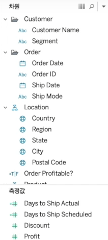
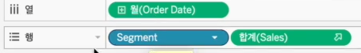
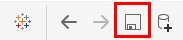
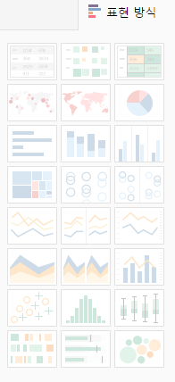

# 데이터 작업하기

> 태블로에서 데이터 분석을 하는 방법

### 데이터 작업

##### 차원과 측정값

화면 좌측에 위치

- 측정값: 수치

- 차원: 그 수치를 어떤 관점으로 바라볼 것인지

##### 행 선반/열 선반

화면 상단에 위치

- 상단에 열과 행이 적혀있는 부분을 `선반`이라고 칭함
- 초록색은 연속형, 파란색은 불연속형

##### 시트/대시보드/스토리

화면 하단에 위치

- 시트: 하나 하나의 워크스페이스
- 대시보드: 몇 개의 시트를 조합하여 구성하는 하나의 화면
- 스토리: 시트와 대시보드가 조합된 스토리 라인

##### 태블로 마크/되돌리기/저장/데이터 소스 추가

- 태블로 마크: 데이터 연결 화면으로 돌아가기
  - 데이터 연결 화면에서 ESC키를 누르면 다시 데이터 작업 화면으로 돌아감

- Redo & Undo: 이전으로 돌아가기/재실행하기

- 저장: 작업한 내용 저장하기

- 데이터 소스 추가: 데이터 연결 화면으로 가지 않고  새로운 데이터 연결

##### 시트 관련 작업

- 새 워크시트: 새로운 워크시트 추가

- 복제: 현재 화면에 있는 시트 복제

- 시트 지우기: 작업창 초기화

##### 데이터 관련 작업

- 행, 열 바꾸기: 행 선반과 열 선반에 각각 있는 모든 데이터를 맞교환

- 정렬: 오름차순 정렬과 내림차순 정렬

##### 추가 작업

- 레이블 붙이기

- 화면 크기 조정: 표준, 너비 맞추기, 높이 맞추기, 전체 보기

- 프레젠테이션 모드

  - ESC를 누르면 편집 모드로 돌아감

  

##### 표현방식

태블로에서 제공하는 속성으로 빠르게 차트를 그리는 기능

- 활성화 되지 않는 차트는 지금 지정된 행/열로는 생성할 수 없다는 의미

