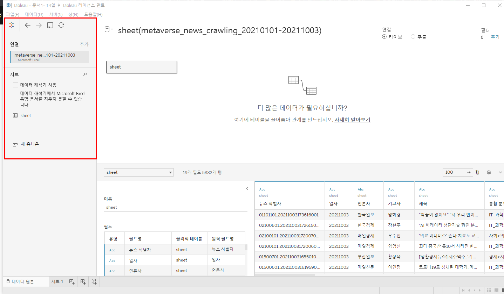
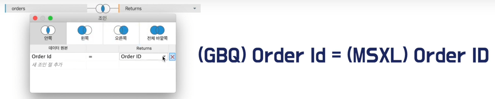
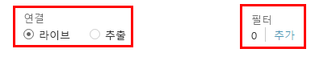

# 데이터 준비하기

> 태블로에서 데이터 분석을 위해 준비하는 방법

##### 연결 데이터 선택

- 연결할 테이터를 선택하면 다음과 같이 데이터 준비 화면이 나타남
- 왼쪽에서 연결된 데이터를 확인 할 수 있음
- 사용할 데이터를 가운데 화면으로 drag and drop해서 사용

- 태블로는 서로 다른 데이터베이스에 있는 데이터를 조인할 수 있음

### 데이터 준비

##### 라이브 VS 추출

- 라이브: 항상 데이터베이스를 향해 직접적으로 쿼리를 날림
  - 장점: 신속한 업데이트
  - 단점: DB 부하, 늦은 처리 속도
- 추출: 데이터베이스의 현재 상태를 로컬에 복사본 처럼 저장
  - 장점: 빠른 처리 속도, 모든 종류의 태블로 기능 사용 가능
  - 단점: 느린 업데이트 주기

##### 데이터 원본 필터

- 데이터의 과부화를 막기 위해 작업할 때 필요한 데이터만 불러와서 사용